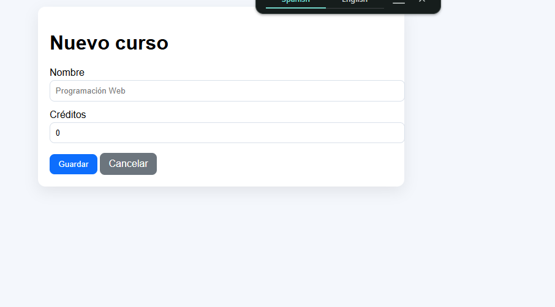
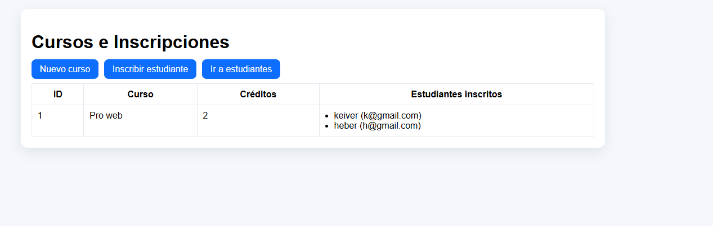
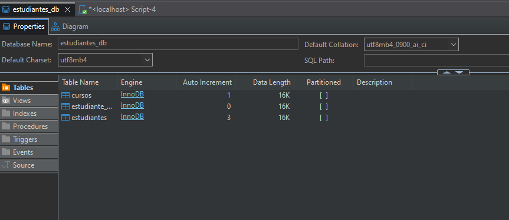
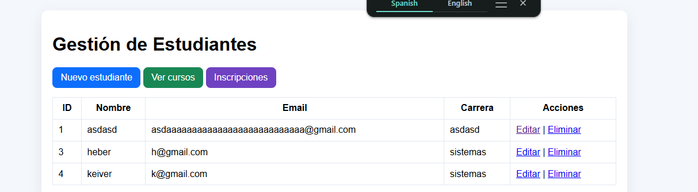

# daza-post2-u8

Extensión del CRUD de Estudiante con relación @ManyToMany bidireccional entre Estudiante y Curso, más gestión de inscripciones.

## Estructura por capas

- model: Estudiante, Curso
- repository: EstudianteRepository, CursoRepository (incluye JOIN FETCH)
- service: EstudianteService, CursoService
- controller: EstudianteController, CursoController
- templates/estudiantes: lista, formulario, confirmar-eliminar
- templates/cursos: lista, formulario, inscripcion

## Prerrequisitos

- JDK 17+
- Maven 3.8+
- MySQL 8+
- Base de datos estudiantes_db

## Funcionalidades

- CRUD de estudiantes
- CRUD básico de cursos
- Inscripción estudiante-curso con tabla intermedia estudiante_curso
- Consulta optimizada de cursos con estudiantes usando JOIN FETCH

## Configuración BD sugerida

- URL: jdbc:mysql://localhost:3306/estudiantes_db
- Usuario: appuser
- Clave: apppass

## Ejecución

1. Crear base de datos y usuario en MySQL
2. Ajustar credenciales en application.properties
3. Ejecutar: mvn spring-boot:run
4. Abrir: <http://localhost:8080/estudiantes>
5. Gestionar cursos e inscripciones en /cursos

## Capturas

